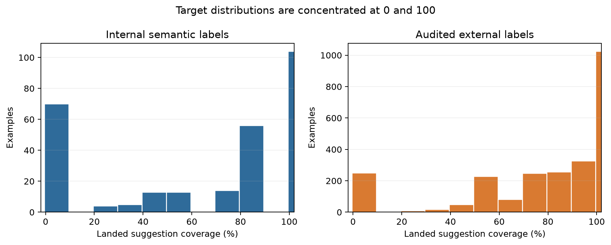
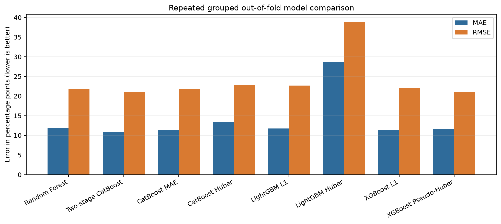
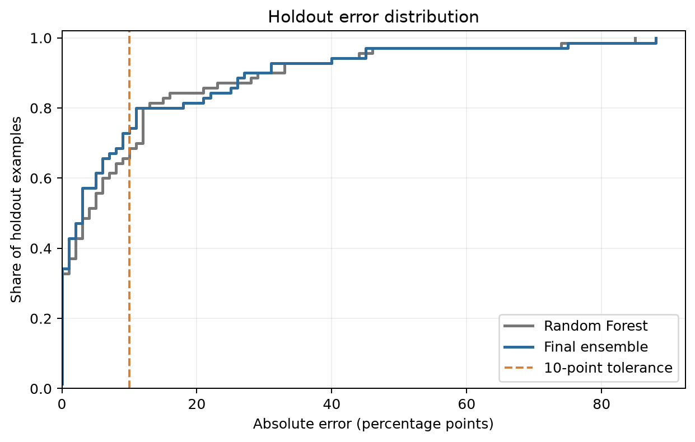
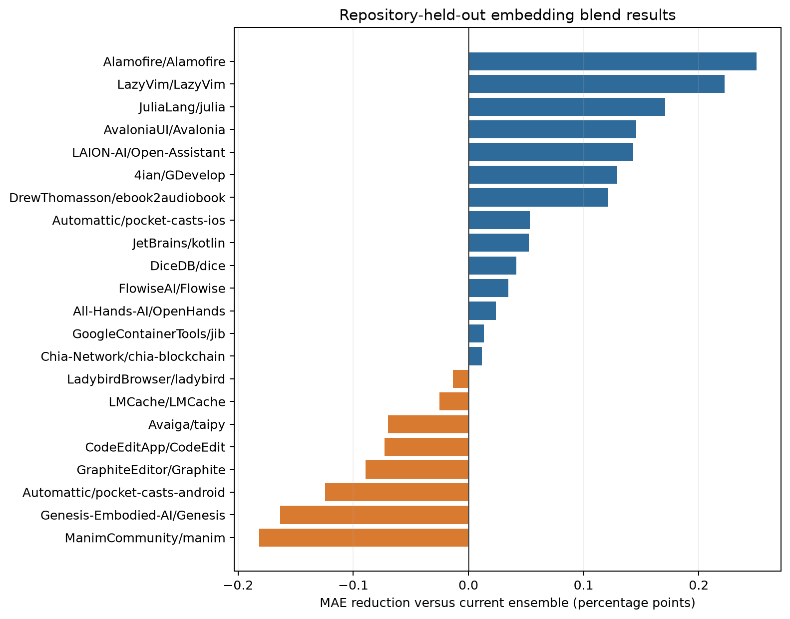
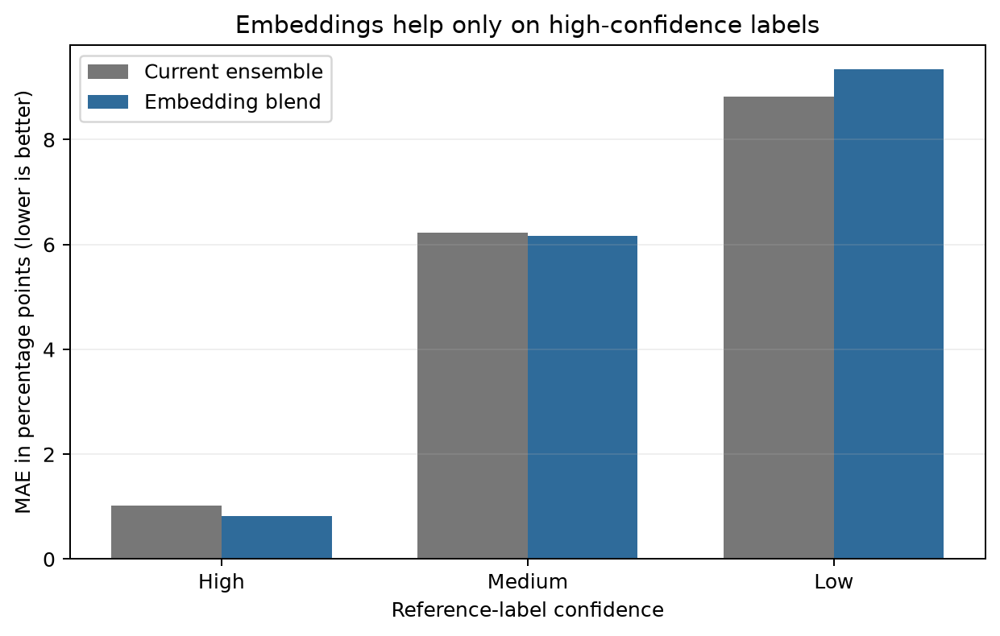
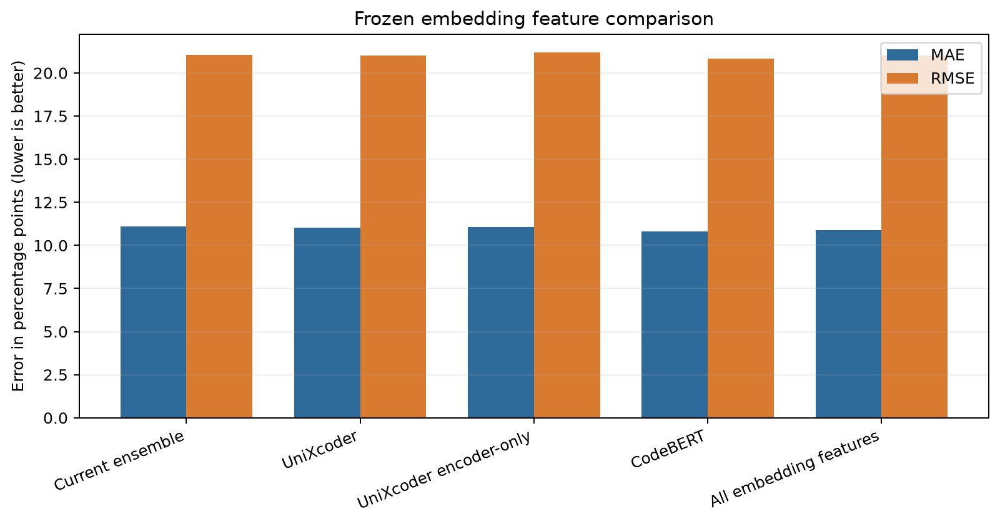

# Estimating How Much of a Code-Review Suggestion Reaches the Final Code

## A Group-Aware, Confidence-Weighted Ensemble for Continuous Semantic Coverage

**Document type:** Research-grade internal working paper  
**Project:** Code Compare — PR Suggestion Coverage  
**Authorship:** Named authors to be assigned before external submission  
**Version:** 1.0  
**Date:** 8 September 2026  
**Reproducibility status:** Code, model artifacts, derived statistics, and figures are included in the repository.

## Abstract

Code review tools can show that a suggestion was made, but they do not usually answer a harder question: **how much of that suggestion was actually implemented in the merged code?** Exact text matching is inadequate because developers frequently rename variables, reformat code, move logic, or implement only part of a suggestion. We formulate this task as bounded regression: given a suggested code change and the final pull-request diff, predict one integer semantic-coverage percentage from `0` to `100`.

We combine deterministic lexical, hunk-level, and structural comparison features with confidence-weighted supervised learning. The study uses 279 internal semantic reference labels from 73 pull requests in one repository and 2,500 audited external labels from 1,196 pull requests across 29 repositories. Models are selected using repeated pull-request-grouped validation, preventing examples from the same pull request from appearing in both a training and validation fold. We compare Random Forest, direct CatBoost, a two-stage endpoint-aware CatBoost model, LightGBM, XGBoost, ridge stacking, and constrained convex blends.

The deployed system combines 50% Random Forest, 30% two-stage CatBoost, and 20% direct CatBoost MAE, with a conservative fallback to Random Forest when the blend differs from it by more than 20 percentage points. On a 70-example, 19-pull-request internal holdout, rounded production predictions reduced mean absolute error from 10.157 to 9.743 percentage points and increased the fraction of predictions within 10 points of the reference label from 68.6% to 74.3%. A pull-request-grouped bootstrap estimated the within-10 gain at +5.7 percentage points with a 95% interval of +1.3 to +11.7 points. The MAE reduction was less conclusive: 0.414 points with a 95% interval from -0.094 to +0.896. Root mean squared error worsened slightly by 0.174 points, and the dangerous endpoint error rate was unchanged.

Frozen UniXcoder and CodeBERT similarities were subsequently evaluated as additional features. Embedding-enhanced two-stage models improved several development-fold metrics, and a guarded embedding blend reduced development MAE from 11.110 to 10.766. It did not generalize to the internal holdout: MAE increased from 9.743 to 10.129, RMSE increased from 19.310 to 20.212, and within-10 accuracy decreased from 74.3% to 72.9%. A second evaluation retrained the models 29 times, each time holding out one complete external repository. Across 2,500 repository-held-out predictions, the guarded embedding blend reduced MAE by only 0.022 points, with a repository-bootstrap 95% interval from -0.043 to +0.083. It worsened RMSE by 0.175 points and within-10 accuracy by 0.76 percentage points. The embedding candidate was therefore not deployed.

The results support the non-embedding ensemble as a useful engineering improvement, especially for ordinary near-miss predictions, but not as final evidence of broad generalization. The internal reference labels are model-generated semantic judgments rather than independently adjudicated human ground truth; the internal data come from one repository; and the holdout has been consulted during several deployment decisions. We therefore present the current model as a strong exploratory baseline and define a confirmatory evaluation and a more targeted semantic-model research plan for the next phase.

**Keywords:** code review, semantic code similarity, regression, code clone detection, ensemble learning, weak supervision, software engineering analytics

---

## Plain-Language Summary

### The question

A reviewer proposes a code change. The developer later merges a pull request. We want to answer:

> **What percentage of the meaningful suggestion appears in the final code?**

A prediction of `0` means none of the meaningful suggestion landed. A prediction of `100` means it landed essentially as suggested. A value such as `73` means most of the core behavior landed, but meaningful parts changed or remained absent.

### Why this is difficult

Code can mean the same thing without looking the same. For example:

- a variable can be renamed;
- a condition can be rewritten;
- logic can move into a helper function;
- only two of three requested behaviors may be implemented;
- formatting can change every line without changing behavior.

A simple text comparison treats many of these as different. The system therefore measures several kinds of similarity and lets multiple machine-learning models combine that evidence.

### What was built

The final model is a **guarded ensemble**—three models whose answers are averaged:

- **50% Random Forest:** a stable collection of decision trees;
- **30% two-stage CatBoost:** first decides whether the result looks like `0`, partial, or `100`, then estimates the partial percentage;
- **20% direct CatBoost:** predicts the percentage directly and handles categorical fields such as programming language;
- **safety fallback:** if the combined answer moves more than 20 points away from Random Forest, use Random Forest instead.

### What improved

On the 70-example holdout:

- the average miss decreased from **10.16 to 9.74 points**;
- predictions within 10 points increased from **68.6% to 74.3%**;
- very severe endpoint mistakes did **not** increase;
- sensitivity to rare large errors, measured by RMSE, became **0.17 points worse**.

The clearest result is the increase in predictions within 10 points. The average-error improvement is promising but statistically uncertain because the holdout is small.

### Bottom line

The final ensemble is the best current non-embedding model and is suitable as an **engineering baseline**. It should not yet be described as universally accurate or as equivalent to human review. The next research-grade step is a new, independently labeled, never-before-seen test set from multiple repositories.

Frozen embeddings were also implemented and evaluated. They showed useful signal during development but made the internal holdout worse. A stricter leave-one-repository-out evaluation found only a tiny, uncertain MAE gain while RMSE and within-10 accuracy became worse. They remain **experimental and are not used by production**.

---

## 1. Introduction

Code review suggestions often influence the final implementation without being copied verbatim. Conventional repository analytics can identify whether a suggested patch was applied exactly, but they are less reliable when a developer adapts the patch. This gap matters for measuring suggestion adoption, evaluating automated review systems, and understanding whether proposed changes affect production code.

This study treats suggestion adoption as a **continuous semantic coverage** problem. The input is a suggested diff together with the final landed diff. The output is one integer percentage:

\[
\hat{y} = f(x) \in \{0, 1, \ldots, 100\},
\]

where \(x\) contains deterministic comparison features and \(\hat{y}\) estimates how much of the suggestion's meaningful behavior landed.

This framing differs from ordinary binary classification. A binary answer such as “landed” or “not landed” cannot distinguish a tiny fragment from an almost complete implementation. Percentage prediction also avoids using coarse buckets as the model target. Buckets can still be derived after inference for dashboards, but the public model output remains a percentage.

The work draws on code clone detection, structural differencing, tree ensembles, robust regression, weak supervision, and stacked generalization [1–8]. Its main engineering principle is conservative combination: deterministic evidence remains inspectable, external labels are confidence weighted, validation is grouped by pull request, and a fallback limits large ensemble deviations.

## 2. Research Questions and Contributions

The study investigates four questions:

1. **RQ1 — Representation:** Can deterministic lexical and structural features support useful semantic percentage prediction without embeddings?
2. **RQ2 — Architecture:** Does explicitly modeling endpoint-heavy targets (`0` and `100`) improve prediction?
3. **RQ3 — Ensembling:** Can conservative blending improve ordinary errors without increasing severe endpoint failures?
4. **RQ4 — Evidence quality:** How certain are the observed improvements, and what prevents a stronger scientific claim?

The resulting contributions are:

- a continuous `0–100` formulation for suggestion coverage;
- a language-aware deterministic feature pipeline;
- confidence-weighted use of external semantic labels;
- pull-request-grouped model selection and evaluation;
- an endpoint-aware two-stage CatBoost estimator;
- a guarded three-model ensemble;
- production-aligned metrics based on rounded integer predictions;
- grouped-bootstrap uncertainty estimates;
- a reproducible artifact set and a staged embeddings research agenda.

## 3. Background

### 3.1 Semantic coverage versus text overlap

Text overlap asks, “How many characters, lines, or tokens are shared?” Semantic coverage asks, “How much of the requested behavior exists?” These are related but not identical.

The distinction resembles the standard code-clone taxonomy [1]:

- **Type 1:** same code except formatting or comments;
- **Type 2:** same structure with renamed identifiers or changed literals;
- **Type 3:** copied logic with statements added, removed, or changed;
- **Type 4:** behaviorally similar code implemented differently.

The present system handles Types 1–3 through lexical and structural features. Type 4 remains the most difficult category and motivates the future embedding and cross-encoder work.

> **Plain-language interpretation:** The current model is good at detecting “the same ingredients arranged a little differently.” It is less equipped to prove that two completely different implementations have the same behavior.

### 3.2 Why tree models are appropriate

The feature table mixes continuous scores, yes/no indicators, counts, and categories. Tree ensembles are a strong fit for this kind of structured data:

- **Random Forest** averages many randomized decision trees, usually reducing instability [2].
- **Gradient boosting** builds trees sequentially so that later trees focus on earlier errors [3].
- **CatBoost** is designed to handle categorical fields while reducing target leakage from category encoding [4].
- **LightGBM** and **XGBoost** are efficient gradient-boosting systems with different optimization and regularization choices [5,6].

### 3.3 Why robust losses and ensembles were tested

Some labels are uncertain, and a few predictions can be very wrong. MAE and Huber-style objectives reduce the influence of extreme residuals relative to ordinary squared-error training [7]. Ensembling can help when models make different mistakes. Stacking learns how to combine model outputs, whereas a convex blend uses non-negative weights that sum to one [8].

In a small dataset, a simple blend is often safer than a flexible meta-model. This motivated a minimum 50% weight on the incumbent Random Forest and a disagreement fallback.

## 4. Data and Semantic Reference Labels

### 4.1 Data sources

Two sources were used.

| Source | Rows | Pull requests | Repositories | Role |
|---|---:|---:|---:|---|
| Internal semantic set | 279 | 73 | 1 | Model selection and internal evaluation |
| Audited external set | 2,500 | 1,196 | 29 | Training augmentation only |
| **Total** | **2,779** | **1,269** | — | — |

The external examples derive from the `ronantakizawa/github-codereview` dataset and are stored separately from the internal data [18]. Repository counts should not be summed because source overlap was not asserted.

### 4.2 Label definition

Each label represents the estimated proportion of meaningful suggestion units that landed. Labeling follows six steps:

1. identify meaningful units such as API calls, conditions, assignments, tests, or configuration effects;
2. assign greater importance to core behavior than to boilerplate;
3. locate exact or equivalent implementation in the landed diff;
4. mark each unit as exact, equivalent, partial, absent, or differently implemented;
5. estimate the weighted semantic coverage percentage;
6. derive any reporting bucket only after the percentage is chosen.

The target is therefore a structured semantic judgment, not raw changed-line overlap.

### 4.3 Label provenance and confidence

The semantic references were produced through language-model-assisted labeling prompts with explicit reasoning fields. They are **reference labels**, not independently adjudicated human ground truth.

Internal confidence distribution:

| Confidence | Rows | Share |
|---|---:|---:|
| High | 178 | 63.8% |
| Medium | 99 | 35.5% |
| Low | 2 | 0.7% |

External confidence distribution:

| Confidence | Rows | Share |
|---|---:|---:|
| High | 1,236 | 49.4% |
| Medium | 822 | 32.9% |
| Low | 442 | 17.7% |

The external audit assigned training weights from `0.08` to `1.25`, with a mean of `0.636`. Twenty external rows received explicit manual overrides. High-confidence, medium-confidence, mixed-evidence, fuzzy-only, and metric-disagreement cases were tracked separately.

> **Why weighting helps:** A training weight is a volume control. High-confidence examples speak loudly during training; uncertain examples still contribute, but more quietly.

This is related to weak-supervision practice, where imperfect labels are retained with explicit quality controls rather than treated as equally reliable [19]. It does not eliminate label bias.

### 4.4 Target distribution

The task is strongly endpoint-heavy.

| Source | Exact 0 | Intermediate 1–99 | Exact 100 |
|---|---:|---:|---:|
| Internal | 70 | 105 | 104 |
| External | 250 | 1,225 | 1,025 |



**Figure 1.** Reference percentages in both sources. Exact endpoints are common, especially `100`. This distribution motivates treating endpoint identification and intermediate regression as related but distinct problems.

## 5. Feature Engineering

The system computes 36 model inputs from the suggestion and landed diff: 28 numeric, three Boolean, and five categorical features.

### 5.1 Lexical containment

These features ask how much of the suggestion appears in the landed code:

- normalized line recall;
- token recall;
- identifier-normalized recall, which tolerates renamed variables and functions;
- literal-normalized recall, which tolerates changed constants or strings;
- combined identifier-and-literal normalization;
- exact normalized match.

Recall is emphasized because the primary question is containment: “How much of the suggestion can be found?” A large pull request may contain much unrelated code, so whole-diff similarity would dilute the relevant signal.

### 5.2 Candidate-hunk matching

The evaluator divides the landed diff into candidate hunks and keeps evidence from the best-matching local region. Features include:

- best-hunk token precision, recall, and F1;
- contiguous-line match ratio;
- token longest-common-subsequence recall;
- hunk-size ratio;
- meaningful-anchor recall;
- candidate-hunk count and selected candidate type.

> **Plain-language interpretation:** Instead of comparing a five-line suggestion with an entire 500-line pull request, the model first finds the most relevant neighborhood.

### 5.3 Structural evidence

Language-aware parsers add:

- structural similarity;
- structural node recall;
- parser availability and parser identity;
- GumTree edit-operation counts and insert/delete/update/move ratios [11].

Structural features can recognize that control flow or syntax shape remains similar when surface text changes.

### 5.4 Repository context

The remaining features include file overlap, changed-line overlap, programming language, tokenizer, and structural language. These fields help the model interpret the similarity scores in context rather than serving as labels themselves.

## 6. Models

### 6.1 Random Forest baseline

The baseline uses 400 regression trees, `min_samples_leaf=7`, and `max_features=0.8`. All audited external examples are included with confidence-dependent weights. This model is stable, fast, and relatively resistant to overfitting on mixed tabular features.

### 6.2 Direct boosting models

The comparison includes:

- CatBoost with MAE loss;
- CatBoost with Huber loss;
- LightGBM with L1 loss;
- LightGBM with Huber loss;
- XGBoost with absolute-error loss;
- XGBoost with pseudo-Huber loss.

These candidates test whether different boosting algorithms and robust objectives better handle noisy labels and rare large errors.

### 6.3 Two-stage CatBoost

The target contains many exact zeros and hundreds. A single regressor can pull these endpoints toward the middle. The two-stage estimator therefore:

1. classifies the row into `0`, `intermediate`, or `100`;
2. predicts a continuous value from `1` to `99` for the intermediate regime;
3. combines class probabilities with the intermediate estimate;
4. emits an exact endpoint when its class probability exceeds `0.55`.

The intermediate estimate is conceptually:

\[
\hat{y}_{soft} = 100p_{100} + p_{intermediate}\hat{y}_{intermediate}.
\]

High-confidence endpoint probabilities can replace this soft result with exactly `0` or `100`.

### 6.4 Final guarded ensemble

Repeated grouped validation selected this blend:

\[
\hat{y}_{blend} = 0.50\hat{y}_{RF} + 0.30\hat{y}_{two-stage} + 0.20\hat{y}_{CatBoost-MAE}.
\]

If \(|\hat{y}_{blend}-\hat{y}_{RF}| > 20\), the Random Forest prediction is used. The result is clipped to `[0,100]` and rounded to the nearest integer.

The fallback is intentionally conservative. It lets specialist models make modest corrections but blocks unusually large movement away from the stable baseline.

## 7. Experimental Design

### 7.1 Grouped splitting

Rows from the same pull request can share code, context, or reviewer behavior. Random row-level splitting would leak this information and exaggerate performance. All splits are therefore grouped by pull-request URL.

The internal data were divided into:

- **development:** 209 rows;
- **holdout:** 70 rows from 19 pull-request groups.

The development set used three repetitions of four-fold grouped out-of-fold evaluation with seeds `17`, `42`, and `83`. External data were added only to training folds. The internal validation fold determined candidate quality.

> **What “out-of-fold” means:** Every development prediction is made by a model that did not train on that row or its pull request. This gives a more honest rehearsal than measuring the model on its training examples.

### 7.2 Model and ensemble selection

Within each model family, the candidate with the lowest grouped out-of-fold MAE was retained, using RMSE as a tie-breaker. Convex blend weights were searched in 0.1 increments. Eligible blends had to:

- contain at least two models;
- retain at least 50% Random Forest weight;
- not worsen out-of-fold RMSE relative to Random Forest;
- not worsen the dangerous endpoint error rate.

Ridge stacking was evaluated separately. Deployment required improved holdout MAE, no worse within-10 performance, no increase in dangerous errors, and no more than 2% RMSE regression.

### 7.3 Production-aligned evaluation

All final metrics use the exact format returned to callers:

1. clip to `[0,100]`;
2. round to the nearest integer;
3. calculate errors from those integers.

This avoids reporting results on hidden decimal predictions that users never receive.

### 7.4 Metrics

| Metric | Meaning | Why it matters |
|---|---|---|
| MAE | Average absolute miss in percentage points | Easy to interpret; every point has equal cost |
| RMSE | Like MAE, but large misses count much more | Detects rare, severe failures |
| Within 5 | Share no more than five points from reference | Measures high precision |
| Within 10 | Share no more than ten points from reference | Practical near-match measure |
| Dangerous error | Prediction ≥80 when reference ≤20, or vice versa | Captures a reversal of the practical conclusion |
| R² | Fraction of target variation explained relative to predicting the mean | Familiar global fit measure, but secondary here |

MAE and within-10 are primary. RMSE and dangerous errors act as safety checks.

### 7.5 Uncertainty estimation

The holdout is small, and its rows are clustered by pull request. We therefore generated 10,000 bootstrap samples by resampling the 19 holdout pull requests with replacement [10]. All rows from a sampled pull request move together.

This produces uncertainty intervals for the **paired difference** between Random Forest and the ensemble. It is more appropriate than treating 70 rows as independent observations.

### 7.6 Repository-held-out embedding evaluation

To test transfer beyond the internal split, we performed leave-one-external-repository-out evaluation across all 29 external repositories. For each fold, one repository was excluded completely; all 279 internal rows and the other 28 external repositories formed the training set; predictions were then made only for the excluded repository. This produced one out-of-repository prediction for every one of the 2,500 external rows.

The comparison included the current ensemble, three individual embedding-enhanced two-stage models, a combined-embedding model, and the previously selected guarded embedding blend. Uncertainty was estimated with 10,000 bootstrap samples whose sampling unit was the repository. No model, feature set, blend weight, or threshold was changed using these results.

> **Why hold out a whole repository:** Code style, frameworks, naming, and contributor behavior repeat within a project. A row-level split can therefore look accurate merely because the model has already seen similar project-specific patterns. Repository-held-out evaluation asks the harder question: does the model transfer to a project it did not train on?

## 8. Results

### 8.1 Candidate comparison

Repeated grouped out-of-fold results on the 209-row development set were:

| Candidate | MAE ↓ | RMSE ↓ | Within 10 ↑ | Dangerous error ↓ |
|---|---:|---:|---:|---:|
| Random Forest | 11.952 | 21.735 | 66.0% | 1.91% |
| **Two-stage CatBoost** | **10.866** | 21.124 | 68.9% | 0.96% |
| CatBoost MAE | 11.340 | 21.835 | **70.8%** | **0.48%** |
| CatBoost Huber | 13.373 | 22.811 | 62.2% | 1.44% |
| LightGBM L1 | 11.732 | 22.644 | 69.4% | 1.44% |
| LightGBM Huber | 28.555 | 38.869 | 23.9% | **0.48%** |
| XGBoost L1 | 11.426 | 22.103 | 68.4% | 0.96% |
| **XGBoost Pseudo-Huber** | 11.569 | **20.988** | 67.5% | **0.48%** |



**Figure 2.** Candidate out-of-fold error. Two-stage CatBoost had the best standalone MAE, while XGBoost Pseudo-Huber had the best RMSE. LightGBM Huber severely underfit this target.

No model dominated every metric. This supports ensembling: two-stage CatBoost improved typical absolute error; direct CatBoost MAE improved tolerance accuracy and dangerous-error behavior; Random Forest supplied stability.

### 8.2 Holdout performance

| Metric | Random Forest | Final ensemble | Difference |
|---|---:|---:|---:|
| MAE | 10.157 | **9.743** | **0.414 lower** |
| RMSE | **19.136** | 19.310 | 0.174 higher |
| R² | **0.735** | 0.730 | 0.005 lower |
| Within 5 | 55.7% | **61.4%** | **+5.7 points** |
| Within 10 | 68.6% | **74.3%** | **+5.7 points** |
| Dangerous error | 1.43% | 1.43% | unchanged |



**Figure 3.** Cumulative absolute-error distribution. At the 10-point tolerance line, the ensemble covers more holdout examples. The curves cross at larger errors, consistent with slightly worse RMSE.

### 8.3 Statistical uncertainty

| Paired improvement measure | Estimate | Pull-request-grouped 95% interval | Bootstrap samples above zero |
|---|---:|---:|---:|
| MAE reduction | +0.414 points | -0.094 to +0.896 | 94.4% |
| RMSE reduction | -0.174 points | -0.593 to +0.327 | 23.7% |
| Within-5 gain | +5.7 percentage points | -3.4 to +16.2 | 83.5% |
| **Within-10 gain** | **+5.7 percentage points** | **+1.3 to +11.7** | **98.9%** |
| Dangerous-error reduction | 0.0 points | 0.0 to 0.0 | 0.0% |

The within-10 improvement is the strongest result: its grouped-bootstrap interval remains above zero. The MAE estimate favors the ensemble in 94.4% of bootstrap samples, but its 95% interval crosses zero. The data therefore support “better practical tolerance accuracy” more strongly than “definitively lower average error.”

These intervals describe resampling uncertainty within this holdout. They do not correct label bias, repository bias, or repeated consultation of the holdout.

### 8.4 Endpoint and intermediate behavior

| Reference regime | Rows | RF MAE | Ensemble MAE | RF within 10 | Ensemble within 10 |
|---|---:|---:|---:|---:|---:|
| Exact 0 | 12 | 12.42 | **11.33** | 75.0% | 75.0% |
| Intermediate 1–99 | 31 | 11.48 | **11.10** | 61.3% | **71.0%** |
| Exact 100 | 27 | 7.63 | **7.48** | 74.1% | **77.8%** |

The largest tolerance gain occurred for intermediate examples, the exact region the two-stage design was intended to improve. Subgroup sample sizes are too small for firm inferential claims.

### 8.5 Inference performance

On the evaluation machine, warm inference over 2,500 rows took:

- Random Forest: median `0.0439` seconds;
- final ensemble: median `0.0507` seconds;
- slowdown: `1.16×`;
- ensemble throughput: approximately `49,000` rows per second.

Model loading and feature extraction were excluded from this component-only timing. Hardware details were not captured, so this benchmark should be treated as a relative local measurement, not a universal latency guarantee.

### 8.6 Repository-held-out embedding performance

The leave-one-repository-out study covered 2,500 external rows, 1,196 pull requests, and 29 repositories. Each value below is calculated from rounded integer predictions, matching production output.

| Model | MAE ↓ | RMSE ↓ | Within 5 ↑ | Within 10 ↑ |
|---|---:|---:|---:|---:|
| **Current ensemble** | 4.106 | **8.821** | 76.64% | **89.16%** |
| UniXcoder two-stage | 4.320 | 9.847 | 76.68% | 87.40% |
| UniXcoder encoder-only | 4.301 | 9.783 | 77.48% | 86.92% |
| CodeBERT two-stage | 4.252 | 9.652 | 77.52% | 88.00% |
| All embedding features | 4.488 | 10.040 | 75.72% | 86.20% |
| Guarded embedding blend | **4.084** | 8.996 | **77.92%** | 88.40% |

The guarded blend's MAE was 0.022 points lower, but the repository-bootstrap 95% interval ranged from -0.043 to +0.083 points, so the direction is uncertain. Its RMSE was 0.175 points worse; the 95% interval for RMSE reduction was entirely negative, from -0.267 to -0.069. Within-10 accuracy decreased by 0.76 percentage points, with an interval from -1.57 to +0.12 points. Dangerous errors were unchanged at 0.16%.



**Figure 4.** Per-repository MAE reduction for repositories with at least ten rows. Positive bars favor the embedding blend. It won in 14 repositories and lost in 8, but the pooled gain was too small and unstable to justify deployment.

Confidence stratification explains part of the mixed result. On 1,236 high-confidence rows, MAE improved from 1.015 to 0.826. On 442 low-confidence rows, it worsened from 8.824 to 9.337, while within-10 accuracy fell from 76.47% to 72.40%. Embeddings appear to sharpen already-clear semantic matches but amplify uncertainty in ambiguous or noisy examples.



**Figure 5.** Repository-held-out MAE by reference-label confidence. The embedding blend helps high-confidence examples slightly, is nearly neutral for medium-confidence examples, and hurts low-confidence examples.

## 9. What Worked, What Did Not, and Why

### 9.1 Successful approaches

**Endpoint-aware modeling.** The two-stage model achieved the best standalone development MAE. Separating endpoint recognition from intermediate regression reflects the target distribution rather than forcing one smooth model to solve both tasks identically.

**Direct CatBoost MAE.** This model supplied complementary errors and the best standalone within-10 score. Native categorical handling is useful for language and parser fields [4].

**Pseudo-Huber XGBoost.** It achieved the lowest candidate RMSE, suggesting robust smooth losses can reduce severe errors even when they do not minimize MAE.

**Constrained blending.** The final ensemble improved common, near-threshold errors while preserving the dangerous-error rate. Requiring substantial Random Forest weight reduced the risk of an aggressive specialist dominating a small dataset.

**Confidence weighting.** Audited external examples expanded the training data without pretending all labels had equal reliability.

### 9.2 Unsuccessful or rejected approaches

**LightGBM Huber.** Its development MAE of 28.555 indicates severe underfitting under the tested settings. A robust loss is not automatically useful; objective scaling and target shape matter.

**CatBoost Huber.** It consistently underperformed CatBoost MAE, so it was not retained.

**Ridge stacking.** The learned meta-model had worse development and holdout behavior than the constrained convex blend. With few internal examples, a meta-learner can overfit correlations among component predictions.

**Unconstrained blending.** Early blending placed too much weight on the two-stage specialist and harmed holdout RMSE. The final minimum-baseline constraint was introduced to control this failure mode.

## 10. Interpretation for Product and Engineering Use

### 10.1 What a prediction means

The output estimates semantic coverage, not code quality, correctness, reviewer value, or causality. A prediction of `80` means the model believes roughly 80% of the meaningful suggestion landed. It does **not** mean:

- the resulting code is 80% correct;
- the reviewer caused 80% of the change;
- there is an 80% probability that the suggestion landed;
- 80% of lines match.

### 10.2 Recommended use

Suitable uses include:

- aggregate reporting over many suggestions;
- prioritizing ambiguous cases for review;
- measuring broad adoption trends;
- comparing model versions under the same evaluation protocol.

Riskier uses include:

- evaluating individual employee performance;
- treating one prediction as definitive evidence;
- comparing repositories without checking distribution shift;
- using the score as a substitute for functional testing.

### 10.3 Suggested user-facing presentation

Return the integer percentage as the primary output. If explanation is needed, show the strongest matching hunk and major feature signals. Any coarse label should be visibly derived from the percentage rather than presented as a second model prediction.

## 11. Threats to Validity and Limitations

### 11.1 Construct validity: what is “true coverage”?

Semantic percentage is inherently judgment based. Two competent reviewers may assign different exact values to a partial implementation. The labels contain reasoning and semantic units, but inter-rater reliability has not been measured.

**Consequence:** Reported errors partly measure disagreement with the labeling procedure, not only model failure.

### 11.2 Label-source bias

Both internal and external references were produced with language-model assistance. External confidence weighting and 20 manual overrides improve quality control but do not provide independent human adjudication.

**Required next step:** Double-label a stratified sample with at least two human reviewers, resolve disagreements with a third reviewer, and report agreement for both percentage and endpoint regime.

### 11.3 External validity

The 279-row internal set comes from one repository. The external set spans 29 repositories but has different provenance and weaker labels. Language-specific holdout groups are small; only Python has more than ten holdout examples among the reported language subgroups.

**Consequence:** Broad claims across organizations, languages, or review cultures are not justified yet.

### 11.4 Holdout reuse and adaptive overfitting

The 70-row holdout was initially reserved from training, but it was subsequently consulted for multiple deployment decisions: baseline tuning, two-stage evaluation, blending, and advanced-model comparison. Repeated decisions based on the same holdout can gradually overfit model development to that holdout, even when model parameters are not fitted directly on it [9].

**Consequence:** Current holdout findings are exploratory rather than confirmatory.

**Required next step:** Freeze the current system, collect a new multi-repository test set, and evaluate exactly once against predeclared primary metrics and acceptance criteria.

### 11.5 Statistical power

The holdout contains 70 rows but only 19 independent pull-request groups. Confidence intervals are therefore wide. The grouped bootstrap is more honest than row-level uncertainty, but it cannot create information absent from the sample.

### 11.6 Feature ceiling

Lexical and structural features still struggle with Type-4 semantic equivalence: code that implements the same behavior through a substantially different form. This is the main expected value of embeddings or cross-encoders.

### 11.7 Reproducibility boundaries

Training code, dependency versions, seeds, data files, and serialized artifacts are available. However:

- the exact CPU and operating-system benchmark details were not recorded;
- external model/service provenance used during labeling is not encoded in each label row;
- some upstream repository and dataset licenses require verification before public redistribution;
- deterministic reproducibility across library or hardware versions is not guaranteed.

## 12. Data Governance and Responsible Use

Datasets containing repository code and review comments may include sensitive or licensed material. Before external publication:

1. verify source licenses and redistribution terms;
2. remove secrets, personal data, and private repository identifiers;
3. document collection dates and inclusion criteria;
4. publish a dataset card and model card following established documentation practice [16,17];
5. define retention and deletion procedures;
6. prohibit people-ranking uses without separate validation and governance review.

The model should support review analytics, not silently determine individual performance or compliance outcomes.

## 13. Embedding Experiments and Future Research

Embeddings were implemented as frozen, cached similarity features because they can encode meaning beyond token and syntax overlap. They were evaluated without replacing the production model.

### 13.1 Implemented experiment

Three feature variants were generated for all 2,779 examples:

- generic mean-pooled **UniXcoder** using immutable revision `5604afdc964f6c53782a6813140ade5216b99006`;
- UniXcoder using its documented encoder-only input marker;
- mean-pooled **CodeBERT** using immutable revision `3b0952feddeffad0063f274080e3c23d75e7eb39`.

Each suggestion was compared with up to eight lexically retrieved landed hunks. Long text was split into overlapping 512-token windows, with at most eight suggestion chunks and four chunks per candidate. Embeddings were normalized and cached by model revision, preprocessing version, maximum length, input profile, and text hash.

Derived features included best cosine similarity, top-three mean, best-to-second margin, candidate mean, landed centroid similarity, same-file and cross-file maxima, vector norms, chunk counts, threshold fractions, and interactions with token and structural similarity.

The following table reports the best embedding-enhanced architecture for each representation: the two-stage percentage model.

| Development candidate | MAE ↓ | RMSE ↓ | Within 10 ↑ | Dangerous error ↓ |
|---|---:|---:|---:|---:|
| Current production ensemble | 11.110 | 21.042 | 67.9% | 1.44% |
| UniXcoder | 11.043 | 21.007 | 67.5% | **0.00%** |
| UniXcoder encoder-only | 11.077 | 21.179 | 67.9% | 0.48% |
| **CodeBERT** | **10.818** | **20.828** | 67.0% | 0.96% |
| All embedding features | 10.880 | 20.999 | **68.4%** | 0.96% |



**Figure 6.** Repeated grouped out-of-fold comparison. CodeBERT produced the strongest individual embedding-enhanced two-stage model, while the combined feature set had the best within-10 accuracy among embedding candidates.

The selected development blend used 50% current ensemble, 10% generic UniXcoder two-stage, and 40% encoder-only UniXcoder two-stage, with a 10-point disagreement fallback. Its development MAE was 10.766 and RMSE was 20.387. However, on the holdout it was worse than production:

| Holdout metric | Production | Embedding blend | Result |
|---|---:|---:|---|
| MAE | **9.743** | 10.129 | worse |
| RMSE | **19.310** | 20.212 | worse |
| Within 5 | 61.4% | **62.9%** | better |
| Within 10 | **74.3%** | 72.9% | worse |
| Dangerous error | 1.43% | 1.43% | unchanged |

The candidate failed three deployment gates and was not promoted. This suggests that frozen embedding similarities contain signal but currently add variance or dataset-specific patterns that do not transfer reliably to the small internal holdout.

On the CPU-only evaluation machine, warmed encoder throughput was approximately 28.0 chunks per second for encoder-only UniXcoder and 27.6 chunks per second for CodeBERT on a fixed 205-chunk sample. This is orders of magnitude more expensive than applying the already-computed tabular model and reinforces the decision to cache embeddings and reserve future cross-encoders for ambiguous cases.

Jina Embeddings 2 was investigated but not executed. The checkpoint requested repository-provided Python through `trust_remote_code`; the safe built-in BERT loader showed an architecture mismatch and missing weights. Executing unreviewed remote code was rejected, and using a partially initialized model would have produced invalid science. Jina remains a future option only after its implementation is security-reviewed or supported natively by the installed runtime.

### 13.2 Repository-held-out interpretation

The repository-held-out experiment strengthens the decision not to deploy embeddings. Every standalone embedding model had worse MAE, RMSE, and within-10 accuracy than the current ensemble. The guarded blend recovered a negligible MAE advantage, but this advantage was statistically uncertain and came with clearly worse RMSE plus lower within-10 accuracy.

These results are still exploratory because the external reference percentages are confidence-weighted, LLM-assisted labels rather than independent human adjudications. They are more informative than a row-level external split about repository transfer, but they cannot establish human-level semantic validity.

### 13.3 Next embedding phase: stronger frozen features

The next frozen-feature iteration should test:

- language-stratified calibration of UniXcoder and CodeBERT similarities;
- hard-negative candidate hunks from the same file and repository;
- layer pooling rather than only final-layer mean pooling;
- Jina's longer context only through an audited implementation [15].

CodeBERT should be included as a widely used code-representation comparator [12], even if it is not expected to win on long diffs.

For each suggestion, derive scalar features rather than immediately feeding hundreds of vector dimensions into the tabular model:

- best suggestion-to-hunk cosine similarity;
- mean of the top three hunk similarities;
- gap between the best and second-best hunk;
- suggestion-to-full-diff similarity;
- same-file and cross-file best similarity;
- counts above fixed similarity thresholds;
- interactions with token and AST overlap.

> **Why start with scalar features:** The internal dataset is small. A handful of interpretable similarity scores is less likely to overfit than hundreds of embedding coordinates.

### 13.4 Phase B: cross-encoder reranking

A bi-encoder compares separately produced vectors and is fast enough to search many hunks. A cross-encoder reads the suggestion and candidate hunk together, allowing deeper token-by-token interaction but requiring more computation [14].

Recommended architecture:

1. deterministic features or a bi-encoder retrieve the top candidate hunks;
2. a cross-encoder scores only those candidates;
3. cross-encoder maximum, mean, and margin become features;
4. uncertain rows receive the expensive path; obvious rows remain on the fast path.

### 13.5 Phase C: supervised semantic model

Only after expanding the human-adjudicated dataset should a transformer be fine-tuned directly. A staged multi-task objective can combine:

- matched versus unmatched pair classification;
- `0` / intermediate / `100` regime classification;
- bounded percentage regression with MAE or Huber loss.

### 13.6 Leakage controls

For every embedding experiment:

- group by pull request and repository where possible;
- fit PCA, scaling, thresholds, and calibration inside training folds only;
- pin model revision and preprocessing version;
- cache vectors by content and model hash;
- never use test rows to choose chunk size, layer, threshold, or blend weight;
- preserve a new confirmatory test set until one final evaluation.

### 13.7 Acceptance criteria

An embedding candidate should replace or augment the current model only if it:

- improves confirmatory MAE and RMSE;
- preserves or improves within-10 performance;
- does not increase dangerous endpoint errors;
- shows stable direction across repositories and major languages;
- fits a declared latency and memory budget;
- reproduces from pinned artifacts.

## 14. Conclusion

This work demonstrates that semantic suggestion coverage can be modeled as a continuous percentage using inspectable lexical and structural evidence. The strongest current non-embedding system is a guarded blend of Random Forest, endpoint-aware CatBoost, and direct CatBoost MAE. It improves practical within-10 tolerance accuracy on the current internal holdout while preserving severe-error behavior and adding modest latency.

The scientific conclusion is deliberately narrower than the engineering result. The ensemble is a credible exploratory baseline, not a universally validated measure of semantic adoption. The within-10 improvement is supported by grouped-bootstrap uncertainty; the MAE improvement remains less certain; and RMSE is slightly worse. Repository-held-out evaluation also shows that frozen embeddings do not provide a robust improvement: their tiny blended MAE gain is uncertain, while RMSE and within-10 accuracy worsen. Label provenance, one-repository internal data, small pull-request count, and adaptive holdout reuse are the principal limitations.

The next milestone should not be another round of tuning against either existing evaluation. It should be a preregistered, independently human-adjudicated, multi-repository confirmatory set. Only after that data exist should hard-negative retrieval, stronger pooling, or selective cross-encoder scoring be compared without repeatedly consulting the confirmatory labels.

---

## Glossary

| Term | Simple explanation |
|---|---|
| Baseline | The existing model that a new approach must beat |
| Bootstrap | Repeatedly resampling observed groups to estimate uncertainty |
| CatBoost | A boosted-tree model designed to handle categorical fields well |
| Categorical feature | A named group rather than a numeric amount, such as programming language |
| Confidence interval | A range showing how much an estimate may vary because the sample is limited |
| Cross-encoder | A model that reads two texts together for a detailed comparison |
| Embedding | A numeric vector intended to represent meaning |
| Ensemble | Multiple models combined into one prediction |
| Feature | A measurable input given to a model |
| Holdout | Data excluded from training and used for final evaluation |
| Huber loss | A training objective less dominated by extreme errors than squared error |
| Leakage | Information reaching training that would not be available for a genuinely new example |
| MAE | The average number of percentage points by which predictions miss |
| Out-of-fold prediction | A prediction made for a row by a model that did not train on that row's group |
| Regression | Predicting a number rather than a category |
| RMSE | An error measure that penalizes large misses especially strongly |
| Semantic | Related to meaning or behavior, not just identical text |
| Weak supervision | Training with useful but imperfect labels and explicit reliability controls |

## Appendix A. Reproduction

### A.1 Environment

Validated package versions:

| Package | Version |
|---|---:|
| Python | 3.14.6 |
| scikit-learn | 1.9.0 |
| CatBoost | 1.2.10 |
| LightGBM | 4.7.0 |
| XGBoost | 3.4.1 |
| PyTorch | 2.14.0 |
| Transformers | 5.16.1 |

Install the pinned project requirements, then run from the repository root.

### A.2 Tests

```bash
PYTHONDONTWRITEBYTECODE=1 PYTHONPATH=src \
  .ml-venv/bin/python -m unittest discover -s tests -v
```

Expected result: 18 passing unit tests.

### A.3 Rebuild the advanced comparison

```bash
PYTHONDONTWRITEBYTECODE=1 PYTHONPATH=src .ml-venv/bin/python \
  -m pr_suggestion_metrics.train_advanced_percentage_models \
  --internal-scores reports/metric_scores.csv \
  --internal-labels data/processed/pr_suggestion_coverage/dataset/labels.csv \
  --hf-scores data/external/github_codereview/metric_scores.csv \
  --hf-labels data/external/github_codereview/dataset/labels.csv \
  --hf-audit data/labeling_batches/hf_semantic_percentage_outputs/audit_report.jsonl \
  --model-dir models/pr_suggestion_coverage_regression
```

### A.4 Rebuild paper statistics and figures

```bash
MPLCONFIGDIR=.matplotlib-cache \
PYTHONDONTWRITEBYTECODE=1 \
PYTHONPATH=src \
.ml-venv/bin/python \
  -m pr_suggestion_metrics.generate_percentage_paper_assets \
  --output-dir docs/paper \
  --model-dir models/pr_suggestion_coverage_regression
```

This command regenerates:

- `docs/paper/analysis_results.json`;
- `docs/paper/assets/target-distributions.png`;
- `docs/paper/assets/candidate-comparison.png`;
- `docs/paper/assets/holdout-error-cdf.png`;
- `docs/paper/assets/embedding-oof-comparison.png`;
- `docs/paper/assets/repository-held-out-mae-differences.png`;
- `docs/paper/assets/repository-held-out-confidence.png`.

## Appendix B. Artifact Map

| Purpose | Path |
|---|---|
| Serialized deployed model | `models/pr_suggestion_coverage_regression/model.joblib` |
| Feature and ensemble schema | `models/pr_suggestion_coverage_regression/feature_schema.json` |
| Final rounded-metric report | `models/pr_suggestion_coverage_regression/evaluation_report.json` |
| Full advanced comparison | `models/pr_suggestion_coverage_regression/advanced_model_comparison.json` |
| Two-stage experiment | `models/pr_suggestion_coverage_regression/two_stage_evaluation_report.json` |
| Label audit | `data/labeling_batches/hf_semantic_percentage_outputs/audit_report.jsonl` |
| Production inference | `src/pr_suggestion_metrics/model_inference.py` |
| Base training and metric code | `src/pr_suggestion_metrics/train_percentage_regressor.py` |
| Two-stage estimator | `src/pr_suggestion_metrics/two_stage_percentage.py` |
| Advanced comparison | `src/pr_suggestion_metrics/train_advanced_percentage_models.py` |
| Paper analysis generator | `src/pr_suggestion_metrics/generate_percentage_paper_assets.py` |
| Embedding feature generator | `src/pr_suggestion_metrics/generate_embedding_features.py` |
| Embedding experiment runner | `src/pr_suggestion_metrics/train_embedding_percentage_models.py` |
| Experimental embedding report | `models/pr_suggestion_coverage_embeddings/evaluation_report.json` |
| Repository-held-out evaluator | `src/pr_suggestion_metrics/evaluate_repository_held_out_embeddings.py` |
| Repository-held-out report | `models/pr_suggestion_coverage_embeddings/repository_held_out/evaluation_report.json` |
| Repository-held-out predictions | `models/pr_suggestion_coverage_embeddings/repository_held_out/repository_predictions.csv` |
| Encoder runtime benchmark | `models/pr_suggestion_coverage_embeddings/runtime_benchmark.json` |

## Appendix C. References

1. C. K. Roy and J. R. Cordy, “A Survey on Software Clone Detection Research,” Queen's University Technical Report 2007-541, 2007. [PDF](https://research.cs.queensu.ca/TechReports/Reports/2007-541.pdf)
2. L. Breiman, “Random Forests,” *Machine Learning*, 45, 5–32, 2001. [doi:10.1023/A:1010933404324](https://doi.org/10.1023/A:1010933404324)
3. J. H. Friedman, “Greedy Function Approximation: A Gradient Boosting Machine,” *The Annals of Statistics*, 29(5), 1189–1232, 2001. [doi:10.1214/aos/1013203451](https://doi.org/10.1214/aos/1013203451)
4. L. Prokhorenkova, G. Gusev, A. Vorobev, A. V. Dorogush, and A. Gulin, “CatBoost: Unbiased Boosting with Categorical Features,” *Advances in Neural Information Processing Systems 31*, 2018. [arXiv:1706.09516](https://arxiv.org/abs/1706.09516)
5. G. Ke et al., “LightGBM: A Highly Efficient Gradient Boosting Decision Tree,” *Advances in Neural Information Processing Systems 30*, 2017. [Paper](https://proceedings.neurips.cc/paper/2017/hash/6449f44a102fde848669bdd9eb6b76fa-Abstract.html)
6. T. Chen and C. Guestrin, “XGBoost: A Scalable Tree Boosting System,” *Proceedings of KDD '16*, 785–794, 2016. [doi:10.1145/2939672.2939785](https://doi.org/10.1145/2939672.2939785)
7. P. J. Huber, “Robust Estimation of a Location Parameter,” *The Annals of Mathematical Statistics*, 35(1), 73–101, 1964. [doi:10.1214/aoms/1177703732](https://doi.org/10.1214/aoms/1177703732)
8. D. H. Wolpert, “Stacked Generalization,” *Neural Networks*, 5(2), 241–259, 1992. [doi:10.1016/S0893-6080(05)80023-1](https://doi.org/10.1016/S0893-6080(05)80023-1)
9. S. Varma and R. Simon, “Bias in Error Estimation When Using Cross-Validation for Model Selection,” *BMC Bioinformatics*, 7:91, 2006. [doi:10.1186/1471-2105-7-91](https://doi.org/10.1186/1471-2105-7-91)
10. B. Efron and R. J. Tibshirani, *An Introduction to the Bootstrap*. Chapman & Hall/CRC, 1993. [doi:10.1201/9780429246593](https://doi.org/10.1201/9780429246593)
11. J.-R. Falleri, F. Morandat, X. Blanc, M. Martinez, and M. Monperrus, “Fine-grained and Accurate Source Code Differencing,” *Proceedings of ASE 2014*, 313–324, 2014. [doi:10.1145/2642937.2642982](https://doi.org/10.1145/2642937.2642982)
12. Z. Feng et al., “CodeBERT: A Pre-Trained Model for Programming and Natural Languages,” *Findings of EMNLP 2020*, 1536–1547. [doi:10.18653/v1/2020.findings-emnlp.139](https://doi.org/10.18653/v1/2020.findings-emnlp.139)
13. D. Guo et al., “UniXcoder: Unified Cross-Modal Pre-training for Code Representation,” *Proceedings of ACL 2022*, 7212–7225. [doi:10.18653/v1/2022.acl-long.499](https://doi.org/10.18653/v1/2022.acl-long.499)
14. N. Reimers and I. Gurevych, “Sentence-BERT: Sentence Embeddings using Siamese BERT-Networks,” *Proceedings of EMNLP-IJCNLP 2019*, 3982–3992. [doi:10.18653/v1/D19-1410](https://doi.org/10.18653/v1/D19-1410)
15. M. Günther et al., “Jina Embeddings 2: 8192-Token General-Purpose Text Embeddings for Long Documents,” 2023. [arXiv:2310.19923](https://arxiv.org/abs/2310.19923)
16. T. Gebru et al., “Datasheets for Datasets,” *Communications of the ACM*, 64(12), 86–92, 2021. [doi:10.1145/3458723](https://doi.org/10.1145/3458723)
17. M. Mitchell et al., “Model Cards for Model Reporting,” *Proceedings of FAT '19*, 220–229, 2019. [doi:10.1145/3287560.3287596](https://doi.org/10.1145/3287560.3287596)
18. R. Takizawa, `github-codereview` dataset. [Hugging Face](https://huggingface.co/datasets/ronantakizawa/github-codereview)
19. A. Ratner et al., “Snorkel: Rapid Training Data Creation with Weak Supervision,” *The VLDB Journal*, 29, 709–730, 2020. [doi:10.1007/s00778-019-00552-1](https://doi.org/10.1007/s00778-019-00552-1)
